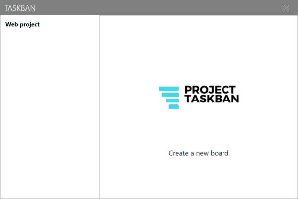
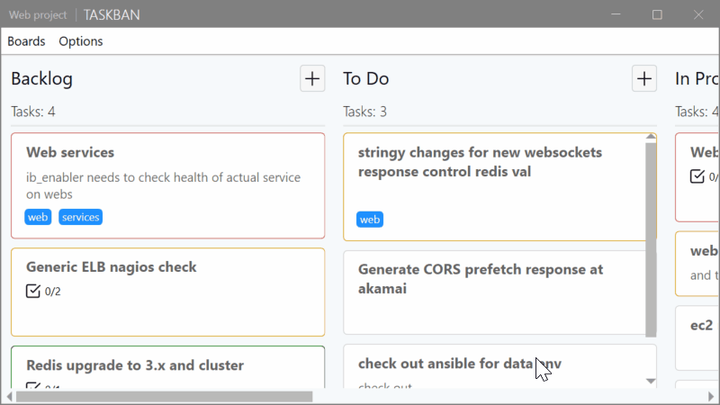

# Taskban

A personal productivity tool developed with C# and XAML. I want it to be a combination of three tools: a task list, a Kanban board and a pomodoro. So, in the future, I will finish developing it.

## Details

The application is simple and only needs a computer with Windows 7, 8 or 10 and Net Core 3.1+ installed. When you run the application, a taskban.db database file is created where the changes made are stored.
* The app requires a Syncfusion license due to the use of WPF Kanban Board which is theirs, but they provide a free community license here: https://www.syncfusion.com/products/communitylicense

## Features

#### A clean, simple UI
* the description is optional

* Manage all your boards from the main window. Double-click to access an already created board or click on the X button to delete it

#### Data Binding everywhere (almost) easy and quick way to create tasks
* Fill in the cards with the information you require, you can give them priority and visibility with tags

* Drag, add, edit and delete cards quickly

## Features I will be adding in the future
* Touch screen support
* Due date of tasks
* Pomodoro
* Edit Kanban Board Columns
* Themes
* Autocompletion of the tags
* Summary of everything in a calendar
* User program configuration

## Built With
* [Net Core 3.1](https://dotnet.microsoft.com/download/dotnet-core/3.1)
* [Windows Presentation Foundation](https://docs.microsoft.com/en-us/visualstudio/designers/getting-started-with-wpf)
* [Syncfusion for WPF Kanban Board](https://www.syncfusion.com/wpf-ui-controls/kanban-board)
* [LiteDB](https://www.litedb.org/) 
* [MahApps.Metro](https://mahapps.com/)

## Download
[Here](https://github.com/jamerbi/Taskban/releases/tag/v0.1.0)

## Authors

* **Jacob Mercado** - [jamerbi](https://github.com/jamerbi)

## License

This project is licensed under the MIT License - see the [LICENSE](LICENSE) file for details
